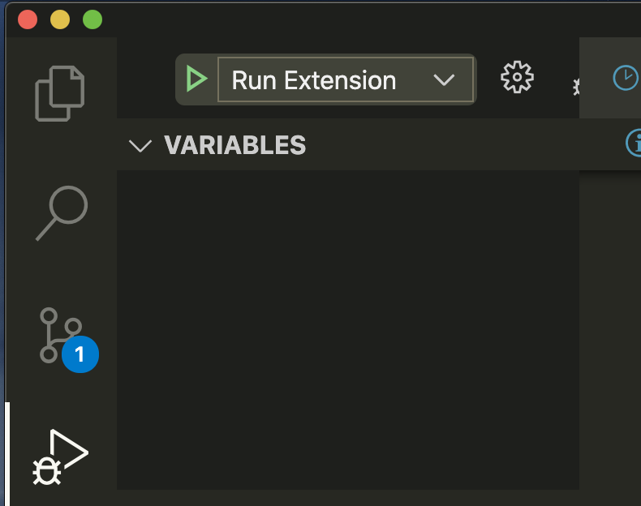

# Flink SQL Extension for Visual Studio Code

An extension for efficiently editing and developing Flink SQL. Provides a simplified experience developing Flink SQL through intelligent editing features and a smooth integration with user's Flink cluster. 


## Feature Overview
### 1. Intelligent Editor
  - Syntax highlighting
  - Autocomplete
  - Documentation for built-in functions

### 2. SQL Snippets
  - Categorize by SQL type and connector
  - Provide required parameters for "CREATE TABLE" statements
  - Press tab to jump to target inputs

### 3. Integration with Local Flink cluster
  - Connect with your local Flink cluster
  - Submit file / selected SQL to configured cluster
  - Real-time submission feedback in output console
  - Flink SQL CLI lifecycle management

### 4. Embedded Monitoring
  - Flink Monitoring Platform 
  - Refresh the page to get the latest job status

### 5. Linking to Flink SQL Monitoring
  - List flink jobs and show their status
  - List task managers
  - Provide external links to Flink Web UI

## Supported Flink Environment
Currently, the following list of flink environment are supported:

1.  Local Flink Clusters
  - Flink clusters that lives in your local environment
  - Start the SQL client with the following: ```./bin/sql-client.sh```

Please specify the path to your flink cluster in settings of this extension.

## How to Install
### 1. Install from the VS Code Extension Marketplace
  We will be publishing the extension in VS Code Market Place. More information about installation will be provided in this section once the extension is published.

  For now, you can build and run the extension locally by pulling a copy of this repository to your local environment. More instructions in the following section. 

### 2. Build and Run Locally
  You can run the extension locally by following the steps below:
  - Download Visual Studio Code
  - Have a copy of this github repository in your local
  - Open the project with VS Code. Click on "Run Extension" in the "Run" explorer panel in VS Code to run the extension. 


## How to use
After you have downloaded this extension, follow the below steps to set up and start coding.

### 1. Configure your flink cluster

  Before directly submit flink sql from our editor, please go to settings to configure the following three fields:
  - Flink Dashboard URL
  - Flink Package Path
  - Command to start Flink SQL Client

### 2. Create a new ```.flinksql``` file

  The extension provides syntax highlight for files with ```.flinksql``` extensions. Naming the files ending in ```.flinksql``` would give you full access to the functionalities of the extension. 
  
### 3. Start developing!

## Contributing to the project

Please refer to the following guide for our contributing guideline: [CONTRIBUTING.md](CONTRIBUTING.md)

Instructions for developing and testing the extension is documented in this [quickstart](vsc-extension-quickstart.md) guide in this repository.
